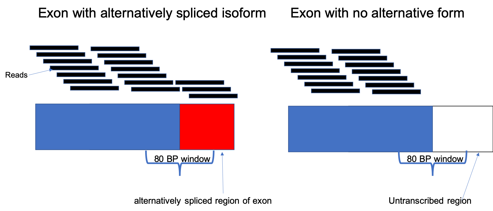
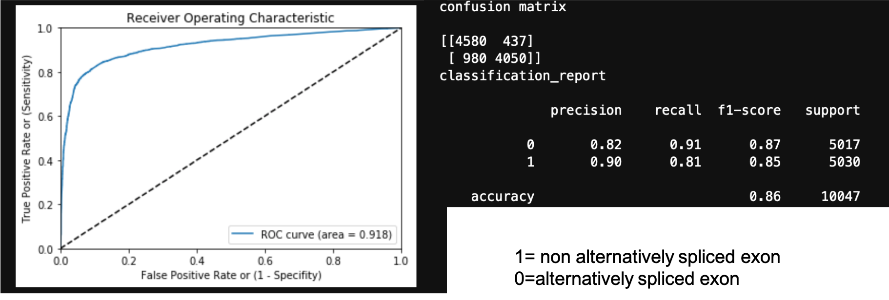

Eyesplice Predictor - use RNA-seq to predict splicing
================

During the Ocular Transcriptome project, there was a stage where I was
constructing novel transcripts, but getting a lot of false positives.
Most of these novel transcripts were novel because of a novel exon, and
a good chunk of novel exons were due to alternative splicing, getting
longer/shorter because of alternate splice sites, or having a retained
intron. I was using base pair level coverage from each novel exon to try
and determine whether a novel exon arising through splicing was real or
not, and it occured to me that this was a good oppurtunity to practice
som machine learning.

# strategy

Using the gencode reference annotation, found exons that had
alternatively spliced versions, and exons that had no alternatively
spliced versions. Aligned RNA-seq data from RPE to genome, and
calculated base pair level coverge. Initially, only looked at exons that
got longer(alternatively spliced form was longer). Used a fixed window
of 80 bp at the junction between the end of the normal exon/ start of
the alternatively spliced region

# Results

It ended up working fairly well, but in my data set, only about ~10% of
novel exons were due to exons getting longer. I ended up finding a
differnt solution for the false positives, so this is way on the back
burner now.
